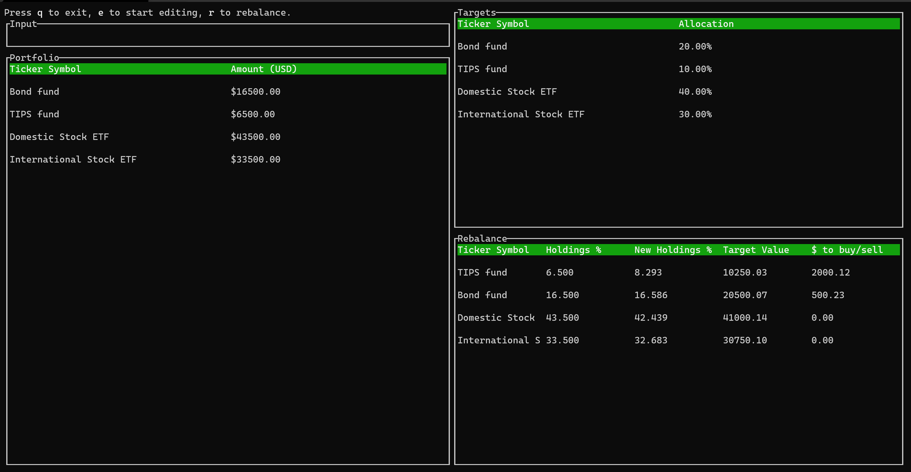

tui-rebalance-app
=============

> TUI for [rebalance-app](https://github.com/dashed/rebalance-app) Optimal lazy portfolio rebalancing calculator (in Rust)

Uses the [tui-rs](https://github.com/fdehau/tui-rs) crate.

## Usage

Create the example/portfolio.csv and example/targets.csv as specified in the [original documentation](https://github.com/dashed/rebalance-app)

Note: keep the format with the value of the assets in the 2nd column.

You can then edit the portfolio inside tui-rebalance by using the arrow key to select the asset and then hit 'e' to enter Edit mode.  Enter the new value of the asset and then press 'enter'.

Once the assets are set correctly pressing 'r' enters Exec mode and you can enter in the amount you want to rebalance by.  The portfolio asset values are saved back to example/portfolio.csv when a rebalance occurs.  

### About

TUI allows you to use the original rebalance-app with a UI and run multiple rebalance calculations in a single session.

TODO:
======

- Add editing for the target.csv.
- Allow the location of the portfolio.csv and targets.csv to be selected by the user.

License
=======

GPL-3.0+.
